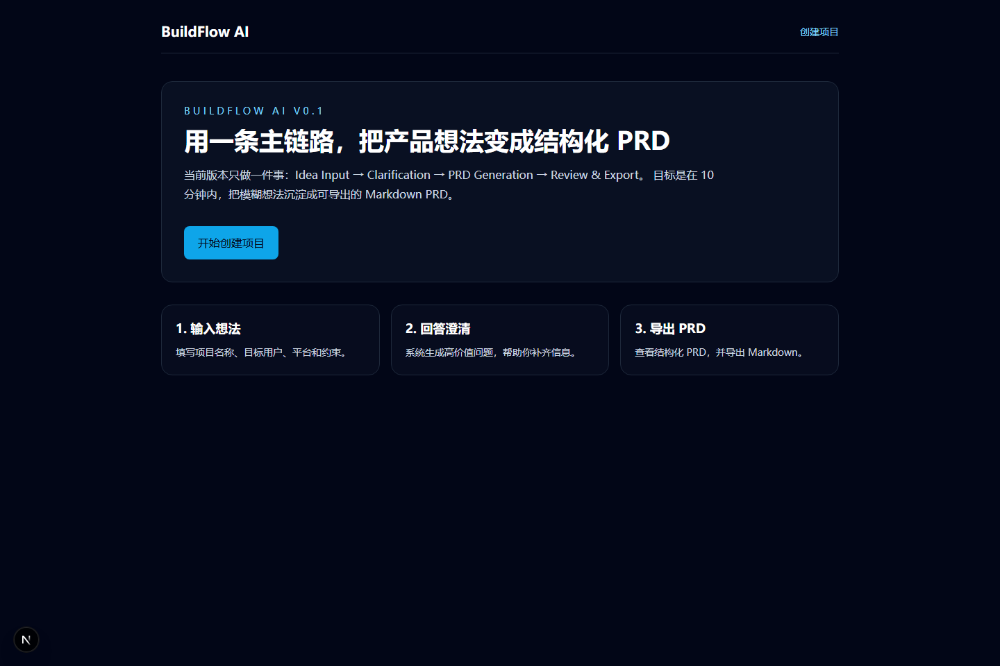
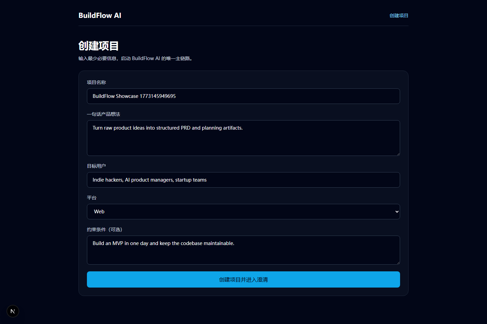
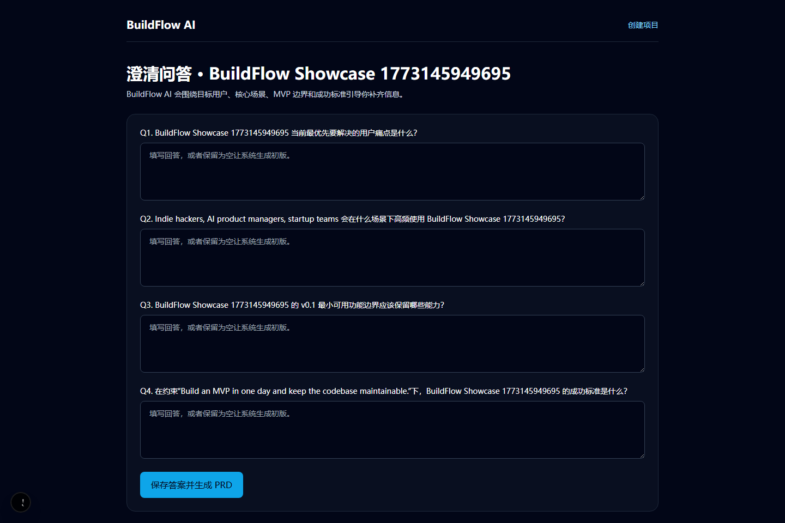
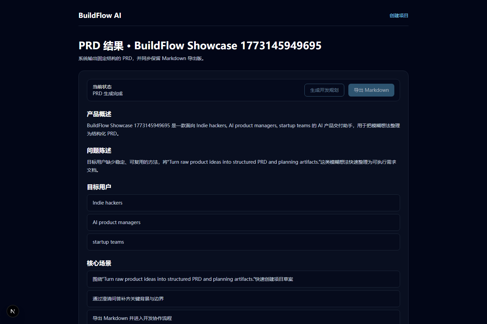
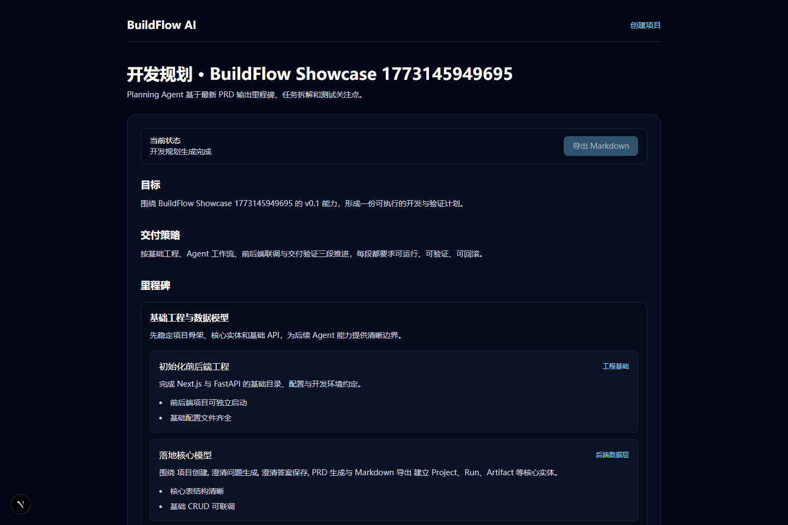
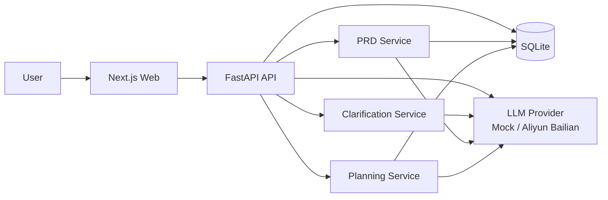

# BuildFlow AI


BuildFlow AI ????? `Next.js + FastAPI` ??? AI Agent ???????????????????? **??? PRD ?????**????????? **?????????????** ????????

?? MVP ????

`Idea Input -> Clarification -> PRD Generation -> Planning Generation -> Review & Export`

## ????

??????????vibe coding ???????????????????? AI ???????

- ???????????????????
- ?? PRD???? API ?????????
- ?? `mock` / ?? Provider ???????????????
- ???????????????????????????

## ???????

- AI ???? / AI ????????
- GitHub ????
- ???????
- ??????????????????????

## ????

> ????????????????? `mock` Provider ????????????

| ?? | ???? |
|---|---|
|  |  |

| ???? | PRD ?? |
|---|---|
|  |  |

| Planning ?? |
|---|
|  |

## ?????

????????????? GitHub Social Preview ???????????

- `docs/assets/social-preview.svg`

?????

- `BuildFlow AI`
- `From Idea to PRD & Planning`

## ????????

?? AI ???????????????????

- ??????????????
- Prompt??????????????
- ??????????????
- ????????????????

BuildFlow AI ????????

**???????AI ??????????? 10 ????????????? PRD ???????????????????????????????**

## ????

- ?????
- AI ????
- 0?1 ????
- ?????????????? PM / ?????

## ????

- ??????????????????????
- ???????????
- ???????????? PRD
- ?? PRD ?????????Planning?
- ?? Markdown ??
- ?? `mock` ??? LLM Provider ??
- ????????????????? E2E ???

## ????



## ????

- **Responses ?? + Chat Completions ??**??????`responses` ???`chat.completions.parse` ??????????
- **?? Provider ???**????????? OpenAI ??????
- **??????**??? `pytest`??? `next build`???? `Playwright E2E`
- **??????**??? PRD????API ?????????????? 0 ? 1?????
- **Windows ??????**??? PowerShell ?????????????

## ???

### ??
- `Next.js 15`
- `React 19`
- `TypeScript`
- `Tailwind CSS`

### ??
- `FastAPI`
- `SQLAlchemy`
- `Pydantic Settings`
- `SQLite`

### ?????
- `pytest`
- `Playwright`
- `PowerShell`
- `Docker`

## ????

```text
api/                 FastAPI ??
web/                 Next.js ??
docs/                PRD????API ???????????????
scripts/             ????????E2E?????
```

## ????

### ??????????

```powershell
powershell -ExecutionPolicy Bypass -File .\scripts\dev.ps1
```

### ????????

```powershell
powershell -ExecutionPolicy Bypass -File .\scripts\test.ps1
```

### ???? GitHub ????

```powershell
powershell -ExecutionPolicy Bypass -File .\scripts\showcase.ps1
```

## ?? Demo ??

??????????????????

- `api/Dockerfile`
- `web/Dockerfile`
- `docker-compose.demo.yml`
- `docs/deployment.md`

?????????

```powershell
docker compose -f .\docker-compose.demo.yml up --build
```

??????

- Web?`http://localhost:3000`
- API?`http://localhost:8000`

???????? `mock` Provider??????

- GitHub ????
- ????
- ?????????
- ?? Demo ??

## ????

- `Python 3.11+`
- `Node.js 20+`
- `npm 10+`
- `Docker`??????????????

## ????

### ?? `api/.env`

???? `mock` Provider????????? API Key????????????

?? `api/.env.example`?

```env
DATABASE_URL=sqlite+pysqlite:///./buildflow.db
LLM_PROVIDER=mock
LLM_MODEL=mock-buildflow-v1
LLM_API_MODE=auto
CORS_ALLOW_ORIGINS=["http://localhost:3000", "http://127.0.0.1:3000"]
```

???????????

```env
LLM_PROVIDER=aliyun_bailian
LLM_MODEL=qwen3.5-plus
LLM_API_MODE=auto
DASHSCOPE_API_KEY=<your-bailian-api-key>
DASHSCOPE_CHAT_BASE_URL=https://dashscope.aliyuncs.com/compatible-mode/v1
DASHSCOPE_RESPONSES_BASE_URL=https://dashscope.aliyuncs.com/api/v2/apps/protocols/compatible-mode/v1
```

### ?? `web/.env.local`

```env
NEXT_PUBLIC_API_BASE_URL=http://localhost:8000
```

## LLM Provider ????

- `LLM_PROVIDER=mock`
  - ???? mock ??
  - ??????????????????

- `LLM_PROVIDER=aliyun_bailian`
  - ??????? OpenAI ????
  - ???????????

- `LLM_API_MODE=auto`
  - ??? `Responses API`
  - ????????????????? `chat.completions.parse`

## ????

???????????????

- ?????`pytest`
- ?????`next build`
- ??????`Playwright E2E`
- ???????`scripts/showcase.ps1`

E2E ????????????
- Web?`http://127.0.0.1:3010`
- API?`http://127.0.0.1:8010`

????????????????
- Web?`http://127.0.0.1:3020`
- API?`http://127.0.0.1:8020`

?????????????????????

## ????

- `docs/prd-v0.1.md`
- `docs/architecture-v0.1.md`
- `docs/api-spec-v0.1.md`
- `docs/iteration-v0.2-alpha-planning.md`
- `docs/e2e-testing.md`
- `docs/deployment.md`
- `docs/showcase-kit.md`

## ?????

??????????? GitHub??????????????????????

- `docs/showcase-kit.md`

????????

- GitHub ?????
- GitHub Topics ??
- ??????????
- ???????
- ??????
- ???????/?????

## Roadmap

- [x] ??? MVP?Idea -> Clarification -> PRD -> Export
- [x] ?????PRD -> Planning -> Export
- [x] ?? LLM Provider ?????????
- [x] ??? E2E ???
- [x] GitHub ??????????
- [x] ?? Demo ?????Docker / Compose / Deployment Docs?
- [ ] ?? Demo ????
- [ ] GIF / ????
- [ ] ????????????
- [ ] ???????????
- [ ] ???? Agent ???????

## ????

???????????? API Key???????????

?????? Fork / ???????

- `api/.env.example`
- `web/.env.local.example`

?????

- `api/.env`
- `web/.env.local`
- ??????????

## License

????? `MIT License`??? `LICENSE`?
