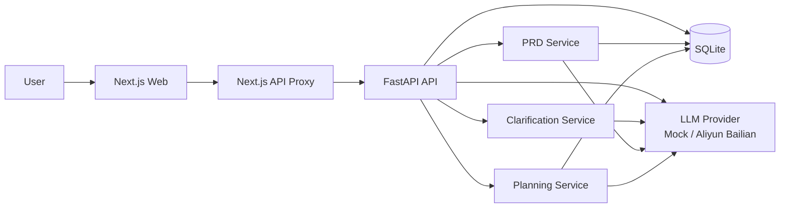

# BuildFlow AI


[](https://chen12413-buildflow-web.onrender.com)
[](https://chen12413-buildflow-api.onrender.com/health)
[](https://github.com/Chen12413/buildflow-ai)
[](https://render.com/deploy?repo=https://github.com/Chen12413/buildflow-ai)

BuildFlow AI is an AI agent workflow project built with `Next.js + FastAPI`. It turns rough product ideas into structured clarification, PRD output, and implementation planning through one end-to-end flow.

> Main flow: `Idea Input -> Clarification -> PRD Generation -> Planning Generation -> Review & Export`

## Live URLs

- Web demo: `https://chen12413-buildflow-web.onrender.com`
- API base: `https://chen12413-buildflow-api.onrender.com`
- Health check: `https://chen12413-buildflow-api.onrender.com/health`

> The live deployment uses the `mock` provider by default, so the full main flow can be tested without any API key.

## Why this project matters

This is not a throwaway vibe-coding prototype. It is a long-term portfolio project focused on business completeness and engineering maintainability.

- Designed for AI product managers, indie builders, and startup teams
- Demonstrates how LLM capability can be embedded into a practical workflow
- Focuses on PRD-driven development, module boundaries, testing, and iteration
- Suitable for GitHub, personal website, and resume presentation

## Core capabilities

- Capture a product idea and create a structured project card
- Generate clarification questions automatically
- Turn clarified inputs into a PRD
- Turn the PRD into an implementation plan
- Export results as Markdown
- Switch between `mock` and real LLM providers
- Support Aliyun Bailian with responses-first and chat fallback strategy
- Cover the flow with backend tests, frontend build checks, and Playwright E2E

## Showcase highlights

- **Real workflow**: not a single feature, but a full agent business chain
- **Maintainable engineering**: API design, structure, scripts, tests, and deployment are all included
- **Provider flexibility**: demo-friendly `mock` mode and real-provider mode both exist
- **Publish-ready**: includes `render.yaml`, Docker, CI, and a public live demo

## Screenshots

| Home | New Project |
|---|---|
|  |  |

| Clarification | PRD |
|---|---|
|  |  |

| Planning |
|---|
|  |

## Architecture



## Tech stack

### Frontend
- `Next.js 15`
- `React 19`
- `TypeScript`
- `Tailwind CSS`

### Backend
- `FastAPI`
- `SQLAlchemy`
- `Pydantic Settings`
- `SQLite`

### Engineering
- `pytest`
- `Playwright`
- `GitHub Actions`
- `Docker`
- `PowerShell` scripts for dev and test workflows

## Quick start

### Local development

```powershell
powershell -ExecutionPolicy Bypass -File .\scripts\dev.ps1
```

Default local URLs:

- Web: `http://localhost:3000`
- API: `http://localhost:8000`

### Run tests

```powershell
powershell -ExecutionPolicy Bypass -File .\scripts\test.ps1
```

Include E2E:

```powershell
powershell -ExecutionPolicy Bypass -File .\scripts\test.ps1 -IncludeE2E
```

## Environment setup

### `api/.env`

Minimal mock configuration:

```env
DATABASE_URL=sqlite+pysqlite:///./buildflow.db
LLM_PROVIDER=mock
LLM_MODEL=mock-buildflow-v1
LLM_API_MODE=auto
CORS_ALLOW_ORIGINS=["http://localhost:3000", "http://127.0.0.1:3000"]
```

Switch to Aliyun Bailian:

```env
LLM_PROVIDER=aliyun_bailian
LLM_MODEL=qwen3.5-plus
LLM_API_MODE=auto
DASHSCOPE_API_KEY=<your-bailian-api-key>
DASHSCOPE_CHAT_BASE_URL=https://dashscope.aliyuncs.com/compatible-mode/v1
DASHSCOPE_RESPONSES_BASE_URL=https://dashscope.aliyuncs.com/api/v2/apps/protocols/compatible-mode/v1
```

### `web/.env.local`

```env
NEXT_PUBLIC_API_BASE_URL=
API_PROXY_TARGET=http://127.0.0.1:8000
```

Notes:

- Leave `NEXT_PUBLIC_API_BASE_URL` empty to use same-origin `/api/*`
- `API_PROXY_TARGET` points the Next.js server-side proxy to the real backend

## Deployment

### Recommended: Render Blueprint

This repo includes `render.yaml` and has already been validated with a live deployment.

It creates two free public services:

- `chen12413-buildflow-api` as a public web service
- `chen12413-buildflow-web` as a public web service

The frontend keeps using same-origin `/api/*`, and the Next.js route handler forwards requests to the backend public URL. The backend URL is injected automatically through Render `fromService.envVarKey: RENDER_EXTERNAL_URL`.

See `docs/deployment.md` for details.

## Project structure

```text
api/                 FastAPI backend
web/                 Next.js frontend
docs/                PRD, deployment, assets, and profile copy
scripts/             Dev, test, E2E, and showcase scripts
render.yaml          Render Blueprint configuration
```

## Roadmap

- [x] Single-flow MVP: Idea -> Clarification -> PRD -> Planning
- [x] `mock` provider and real provider modes
- [x] Aliyun Bailian integration
- [x] Backend tests and frontend build checks
- [x] Playwright E2E
- [x] GitHub-ready repository polish
- [x] Render live deployment
- [ ] Postgres persistence upgrade
- [ ] Team collaboration and history comparison
- [ ] Prompt debugging and evaluation panel

## License

MIT License. See `LICENSE`.
