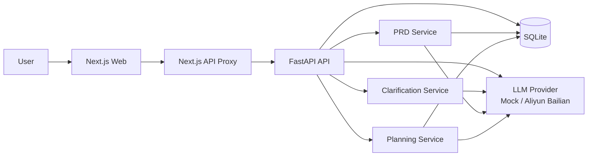

# BuildFlow AI


[](https://render.com/deploy?repo=https://github.com/Chen12413/buildflow-ai)

BuildFlow AI ????? `Next.js + FastAPI` ? AI Agent ??????????????????? PRD ??????????????????????????

> ????`Idea Input -> Clarification -> PRD Generation -> Planning Generation -> Review & Export`

## ????

????????????? demo ?????????????????????????????

- ?? AI ???????????0?1 ????
- ??????????????????
- ?? PRD ????????????????????
- ???? GitHub ????????????????

## ????

- ????????????????
- ???? Clarification ?????????
- ???????? PRD
- ?? PRD ?????????Planning?
- ?? Markdown ???????????
- ?? `mock` ??? LLM Provider ??
- ?????????????`responses` ?? + `chat.completions` ???????
- ?????????????? Playwright E2E

## ???????

- **??????**????????????????????? Agent ???
- **??????**?????? vibe coding ?????????????????????
- **Provider ???**??? `mock` ??????????????????????
- **?????**??? `render.yaml`?Docker ? CI???????? GitHub?

## ????

| ?? | ???? |
|---|---|
|  |  |

| ???? | PRD ?? |
|---|---|
|  |  |

| Planning ?? |
|---|
|  |

## ????



## ???

### ??
- `Next.js 15`
- `React 19`
- `TypeScript`
- `Tailwind CSS`

### ??
- `FastAPI`
- `SQLAlchemy`
- `Pydantic Settings`
- `SQLite`

### ???
- `pytest`
- `Playwright`
- `GitHub Actions`
- `Docker`
- `PowerShell` ??/????

## ????

### 1. ????

```powershell
powershell -ExecutionPolicy Bypass -File .\scripts\dev.ps1
```

?????

- Web?`http://localhost:3000`
- API?`http://localhost:8000`

### 2. ????

```powershell
powershell -ExecutionPolicy Bypass -File .\scripts	est.ps1
```

?? E2E?

```powershell
powershell -ExecutionPolicy Bypass -File .\scripts	est.ps1 -IncludeE2E
```

## ????

### `api/.env`

????? `mock` Provider??? API Key?

```env
DATABASE_URL=sqlite+pysqlite:///./buildflow.db
LLM_PROVIDER=mock
LLM_MODEL=mock-buildflow-v1
LLM_API_MODE=auto
CORS_ALLOW_ORIGINS=["http://localhost:3000", "http://127.0.0.1:3000"]
```

?????????

```env
LLM_PROVIDER=aliyun_bailian
LLM_MODEL=qwen3.5-plus
LLM_API_MODE=auto
DASHSCOPE_API_KEY=<your-bailian-api-key>
DASHSCOPE_CHAT_BASE_URL=https://dashscope.aliyuncs.com/compatible-mode/v1
DASHSCOPE_RESPONSES_BASE_URL=https://dashscope.aliyuncs.com/api/v2/apps/protocols/compatible-mode/v1
```

### `web/.env.local`

```env
NEXT_PUBLIC_API_BASE_URL=
API_PROXY_TARGET=http://127.0.0.1:8000
```

???

- `NEXT_PUBLIC_API_BASE_URL` ??????????? `/api/*`
- `API_PROXY_TARGET` ? Next.js ????????????

## ?? Demo ??

### ???Render Blueprint

?????? `render.yaml`?????????????

??????**?????**???

- `chen12413-buildflow-api`??? `Web Service`
- `chen12413-buildflow-web`??? `Web Service`

?????????? `/api/*`??? Next.js Route Handler ?????????????????????? Render ????? `fromService.envVarKey: RENDER_EXTERNAL_URL` ?????????????? API ???

### ???????????

???????? `Private Service + starter`???? Render ???????????????**??? `free` Web Service**???????????????????????

### ????????

- ???? `mock` Provider
- ????? API Key
- ????????
- ?????????????
- ?????????????? `chen12413-buildflow-api` ????????

????? `docs/deployment.md`?

## Docker Demo

???????

- `api/Dockerfile`
- `web/Dockerfile`
- `docker-compose.demo.yml`

?????

```powershell
docker compose -f .\docker-compose.demo.yml up --build
```

## ????

```text
api/                 FastAPI ??
web/                 Next.js ??
docs/                PRD????????
scripts/             ????????E2E?????
render.yaml          Render Blueprint ????
```

## Roadmap

- [x] ???? MVP?Idea ? Clarification ? PRD ? Planning
- [x] `mock` Provider ??? Provider ???
- [x] ????????Responses ???Chat ?????
- [x] ???????????
- [x] Playwright E2E
- [x] GitHub ?????????
- [x] Render Blueprint ??????
- [ ] ????????? Postgres
- [ ] ?????????????
- [ ] ??????? Prompt ???????

## License

MIT License. See `LICENSE`.
